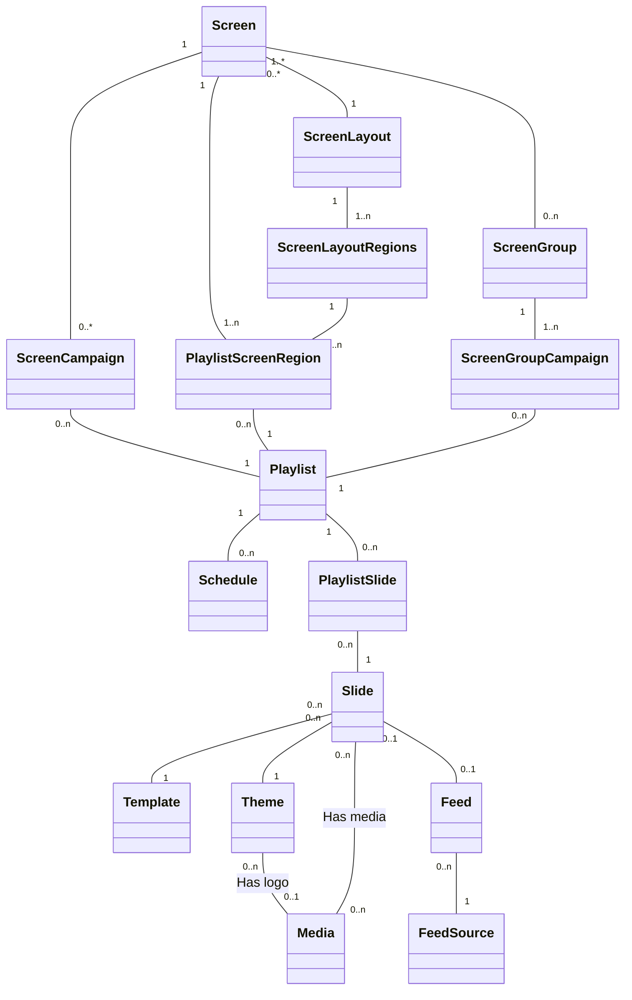

# DisplayApi

## OpenAPI specification

The OpenAPI specification is committed to this repo as `public/api-spec-v1.yaml`
and as `public/api-spec-v1.json`.

A CI check will compare the current API implementation to the spec. If they
are different the check will fail.

If a PR makes _planned_ changes to the spec, the commited file must be updated:

```shell
docker compose exec phpfpm composer update-api-spec
```

If these are _breaking_ changes the API version must be changed accordingly.

## Stateless

The API is stateless except `/v1/authentication` routes.
Make sure to set the `CORS_ALLOW_ORIGIN` correctly in `.env.local`.

## Rest API & Relationships
To avoid embedding all relations in REST representations but still allow the clients to minimize the amount of API calls
they have to make all endpoints that have relations also has a `relationsModified` field:
```
  "@id": "/v1/screens/000XB4RQW418KK14AJ054W1FN2",
  [...]
  "relationsModified": {
    "campaigns": "2024-01-02T11:49:08.000Z",
    "layout": "2024-01-02T11:49:13.000Z",
    "regions": "2024-01-02T11:49:13.000Z",
    "inScreenGroups": "2024-01-02T11:49:05.000Z"
  }
```
The timestamps show the latest `modifiedAt` timestamp for any entity under that key in the relationship tree, weather it
is a direct descendant or a descendant further down the tree. I.e. if a `Screen` has a `Slide` attached through a
`ScreenCampaign` and a `FeedSource` is modified for that `Slide` then the `modifiedAt` timestamp for the `FeedSource`
will be propagated up through the tree to the `campaigns` key under `relationsModified` for the `Screen`.

Updating `relationsModified` is handled in a `postFlush` event listener `App\EventListener\RelationsModifiedAtListener`.
The listener will execute a series of raw SQL statements starting from the bottom of the tree and progressing up.

### Partial Class Diagram
For reference a partial class diagram to illustrate the relevant relationships.



## Development Setup

A `docker-compose.yml` file with a PHP 8.0 image is included in this project.
To install the dependencies you can run

```shell
docker compose pull
docker compose up --detach
docker compose exec phpfpm composer install

# Run migrations
docker compose exec phpfpm bin/console doctrine:migrations:migrate

# Load fixtures (Optional)
docker compose exec phpfpm bin/console hautelook:fixtures:load --no-interaction
```

The fixtures have an admin user: john@example.com with the password: apassword
The fixtures have an editor user: hans@editor.com with the password: apassword
The fixtures have the image-text template, and two screen layouts:
full screen and "two boxes".

## JWT Auth

To authenticate against the API locally you must generate a private/public key pair:

```shell
docker compose exec phpfpm bin/console lexik:jwt:generate-keypair
```

Then create a local test user if needed:

```shell
docker compose exec phpfpm bin/console app:user:add
```

You can now obtain a token by sending a `POST` request to the
`/v1/authentication/token` endpoint:

```curl
curl --location --request 'POST' \
  'http://displayapiservice.local.itkdev.dk/v1/authentication/token' \
  --header 'accept: application/json' \
  --header 'Content-Type: application/json' \
  --data '{
  "email": "editor@example.com",
  "password": "apassword"
}'
```

Either on the command line or through the OpenApi docs at `/docs`

You can use the token either by clicking "Authorize" in the docs and entering

```curl
Bearer <token>
```

as the api key value. Or by adding an auth header to your requests

```curl
curl --location --request 'GET' \
  'http://displayapiservice.local.itkdev.dk/v1/layouts?page=1&itemsPerPage=10' \
  --header 'accept: application/ld+json' \
  --header 'Authorization: Bearer <token>'
```

### Psalm static analysis

[Psalm](https://psalm.dev/) is used for static analysis. To run
Psalm do

```shell
docker compose exec phpfpm composer install
docker compose exec phpfpm vendor/bin/psalm
```

We use [a baseline file](https://psalm.dev/docs/running_psalm/dealing_with_code_issues/#using-a-baseline-file) for Psalm
([`psalm-baseline.xml`](psalm-baseline.xml)). Run

```shell
docker compose exec phpfpm vendor/bin/psalm --update-baseline
```

to update the baseline file.

Psalm [error level](https://psalm.dev/docs/running_psalm/error_levels/) is set
to level 2.

### Composer normalizer

[Composer normalize](https://github.com/ergebnis/composer-normalize) is used for
formatting `composer.json`

```shell
docker compose exec phpfpm composer normalize
```

### Check Coding Standard

The following command let you test that the code follows
the coding standard for the project.

* PHP files [PHP Coding Standards Fixer](https://cs.symfony.com/)

    ```shell
    docker compose exec phpfpm composer coding-standards-check
    ```

* Markdown files (markdownlint standard rules)

    ```shell
    docker compose run --rm node yarn install
    docker compose run --rm node yarn coding-standards-check
    ```

#### YAML

```sh
docker run --volume ${PWD}:/code --rm pipelinecomponents/yamllint yamllint config/api_platform
```

### Apply Coding Standards

To attempt to automatically fix coding style issues

* PHP files [PHP Coding Standards Fixer](https://cs.symfony.com/)

    ```sh
    docker compose exec phpfpm composer coding-standards-apply
    ```

* Markdown files (markdownlint standard rules)

    ```shell
    docker compose run --rm node yarn install
    docker compose run --rm node yarn coding-standards-apply
    ```

## Tests

Run automated tests:

```shell
docker compose exec phpfpm composer tests
```

Disable or hide deprecation warnings using the [`SYMFONY_DEPRECATIONS_HELPER` environment
variable](https://symfony.com/doc/current/components/phpunit_bridge.html#configuration), e.g.

```shell
docker compose exec --env SYMFONY_DEPRECATIONS_HELPER=disabled phpfpm composer tests
```

## CI

Github Actions are used to run the test suite and code style checks on all PRs.

If you wish to test against the jobs locally you can install [act](https://github.com/nektos/act).
Then do:

```shell
act -P ubuntu-latest=shivammathur/node:latest pull_request
```

## Versioning

We use [SemVer](http://semver.org/) for versioning.
For the versions available, see the
[tags on this repository](https://github.com/os2display/display-api-service/tags).
