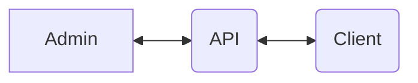
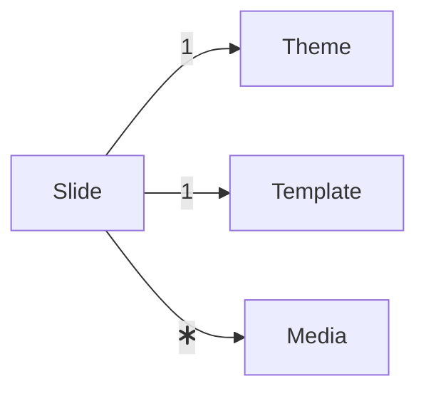
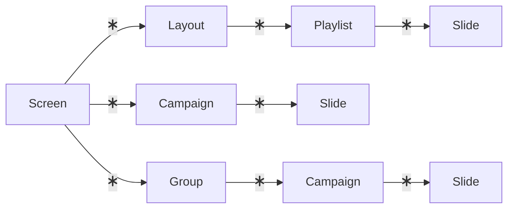
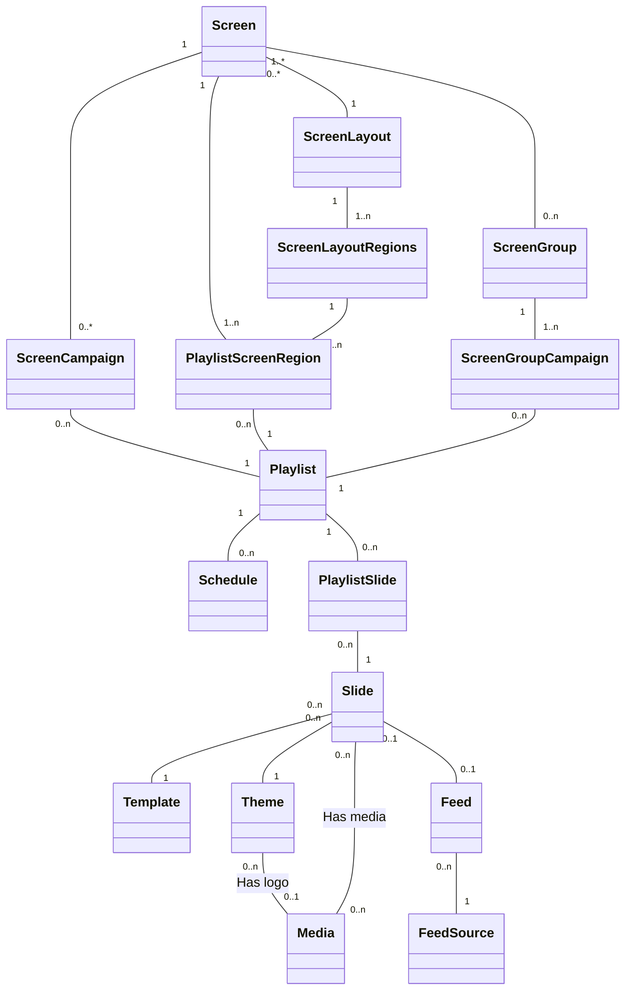

# OS2Display

## Table of Contents

1. [Description](#description)
2. [Content Structure](#content-structure)
3. [ADR - Architectural Decision Records](#adr---architectural-decision-records)
4. [Versioning](#versioning)
5. [Technologies](#technologies)
6. [Taskfile](#taskfile)
7. [Prerequisites](#prerequisites)
8. [Development setup](#development-setup)
9. [Production setup](#production-setup)
10. [Container images](#container-images)
11. [Coding standards](#coding-standards)
12. [Stateless](#stateless)
13. [Authentication](#authentication)
14. [Tenants](#tenants)
15. [OIDC providers](#oidc-providers)
16. [JWT Auth](#jwt-auth)
17. [Test](#test)
18. [API specification and generated code](#api-specification-and-generated-code)
19. [Configuration](#configuration)
20. [Rest API & Relationships](#rest-api--relationships)
21. [Online check for Client](#online-check-for-client)
22. [Error codes in the Client](#error-codes-in-the-client)
23. [Preview mode in the Client](#preview-mode-in-the-client)
24. [Screen status](#screen-status)
25. [Feeds](#feeds)
26. [Themes](#themes)
27. [Templates](#templates)
28. [Custom Templates](#custom-templates)
29. [Screen Layouts](#screen-layouts)
30. [Static analysis](#static-analysis)
31. [Upgrade Guide](#upgrade-guide)
32. [License](#license)
33. [Contributing](#contributing)

## Description

OS2Display is a browser-based system for delivering content to information screens.

At the core of OS2Display is an API that clients communicate with. All data runs through this API.

It includes an Admin for creating content and a Client for displaying the content.

The structure is that slides are the content element of the system. Each slide is based on a Template with content
added. The slides are gathered into playlists. Playlists are then added to screens.
A screen is the connection between a physical device and the content.


```mermaid
flowchart LR
    A[Admin] <-->B(API)
    B <--> C(Client)
```

Further documentation can be found in the
[https://os2display.github.io/display-docs/](https://os2display.github.io/display-docs/).

## Content Structure

| Component | Description                                                                                                                                                                                                                                                                                                                                                            | Accessible by |
|-----------|:-----------------------------------------------------------------------------------------------------------------------------------------------------------------------------------------------------------------------------------------------------------------------------------------------------------------------------------------------------------------------|:--------------|
| Slide     | A slide is the visible content on a screen.                                                                                                                                                                                                                                                                                                                            | Admin, editor |
| Media     | Media is either images or videos used as content for slides.                                                                                                                                                                                                                                                                                                           | Admin, editor |
| Theme     | A theme has css, that can override the slide css.                                                                                                                                                                                                                                                                                                                      | Admin         |
| Template  | The template is how the slide looks, and which content is on the slide. Templates are accessible to choose on Slides.                                                                                                                                                                                                                                                  | Admin, editor |
| Playlist  | A playlist arranges the order of the slides, and the playlist is scheduled.                                                                                                                                                                                                                                                                                            | Admin, editor |
| Schedule  | A rrule-based schedule attached to a playlist, controlling when the playlist's slides are shown.                                                                                                                                                                                                                                                                       | Admin, editor |
| Campaign  | A campaign is a playlist, that takes precedence over all other playlists on the screen. If there a multiple campaigns, they are queued. A campaign is either directly attached to a screen, or attached to a group affecting the screens that are members of that group. If a campaign applies to a screen it fills the whole screen, not just a region of the screen. | Admin         |
| Group     | A group is a collection of screens.                                                                                                                                                                                                                                                                                                                                    | Admin         |
| Layout    | A layout consists of different regions, and each region can have a number of playlists connected. A layout is connected to a screen.                                                                                                                                                                                                                                   | Admin         |
| Screen    | A screen is connected to an actual screen, and has a layout with different playlists in.                                                                                                                                                                                                                                                                               | Admin         |
| Tenant    | A content silo. Users, content and resources belong to a tenant; users may be members of several tenants.                                                                                                                                                                                                                                                              | Admin         |


```mermaid
flowchart LR
    Slide -->|1| D[Theme]
    Slide -->|1| E[Template]
    Slide -->|fa:fa-asterisk| F[Media]
```


```mermaid
flowchart LR
    Screen-->|fa:fa-asterisk|Layout
    Layout -->|fa:fa-asterisk|Playlist
    Playlist -->|fa:fa-asterisk|Slide

    Screen-->|fa:fa-asterisk|G[Campaign]
    G -->|fa:fa-asterisk|H[Slide]

    Screen-->|fa:fa-asterisk|Group

    Group-->|fa:fa-asterisk|L[Campaign]
    L -->|fa:fa-asterisk| M[Slide]
```

## ADR - Architectural Decision Records

Architectural decisions are recorded in `docs/adr`.

## Versioning

We use [SemVer](http://semver.org/) for versioning.
For the versions available, see the
[tags on this repository](https://github.com/os2display/display-api-service/tags).

## Technologies

The API is a PHP project, built with [Symfony](https://symfony.com/) and
[API Platform](https://api-platform.com/).

The Admin and Client are written in javascript and [React](https://react.dev/) and built with [Vite](https://vite.dev/).
There are three Vite entry points (defined in `vite.config.js`): `admin`, `client` and `template`. Shared code lives
in `assets/shared/`.

## Taskfile

The project includes a [taskfile](https://taskfile.dev/) for executing common commands.

See [https://taskfile.dev/docs/installation](https://taskfile.dev/docs/installation) for installation instructions.

If you want to execute the commands without taskfile, look in `taskfile.yml` for the commands that are run.

For a list of commands, run:

```shell
task --list-all
```

## Prerequisites

Local development relies on:

- [Docker](https://www.docker.com/) and Docker Compose
- [Task](https://taskfile.dev/) for running project commands
- A reverse proxy mapping the local domain to the stack. The default domain is
  `display.local.itkdev.dk` (configurable via `COMPOSE_DOMAIN` in `.env`); itk-dev's
  setup is documented at [itk-dev/devops_itkdev-docker](https://github.com/itk-dev/devops_itkdev-docker).

PHP 8.3+ and Node are only required if you build or run scripts directly on the host;
otherwise the containers provide them.

## Development setup

Before first installation a JWT Auth keypair should be generated. See [JWT Auth](#jwt-auth).

```shell
docker compose exec phpfpm bin/console lexik:jwt:generate-keypair
```

To get started with the development setup, run the following task command:

```shell
task site-install

# or if you want to load fixtures as well
task site-install-with-fixtures
```

If you want to load fixtures manually, use the command (`--yes` for auto-confirming):

```shell
task fixtures:load --yes
```

The fixtures have an admin user: <admin@example.com> with the password: "apassword".

The fixtures have an editor user: <editor@example.com> with the password: "apassword".

The fixtures have the image-text template, and two screen layouts: "full screen" and "two boxes".

### Reverse proxy & local HTTPS

A fresh clone bundles its own traefik (compose profile `traefik`, enabled by default via
`COMPOSE_PROFILES` in `.env`) that terminates TLS on `:80`/`:443` with a self-signed dev cert.
`task site-install` runs `task dev:cert` for you on first install; re-run it manually with `FORCE=1`
to regenerate (e.g. after changing `COMPOSE_DOMAIN`). The cert covers `COMPOSE_DOMAIN` plus
the `node-` variant and `localhost`. Browsers warn the first time — accept the cert once.

If 80/443 are taken on the host, override via `.env.local`:

```text
HTTP_PORT=8080
HTTPS_PORT=8443
```

### Itkdev developers: host-level traefik opt-in

Itkdev hosts already run a shared traefik on an external `frontend` network. Disable the bundled
traefik and switch to the shared-frontend overlay in `.env.local`:

```text
COMPOSE_PROFILES=
COMPOSE_FILE=docker-compose.yml:docker-compose.shared-frontend.yml
COMPOSE_FRONTEND_NETWORK=frontend
# Optional — restores the legacy wrapper:
TASK_DOCKER_COMPOSE=itkdev-docker-compose
```

Switching modes is safe: the default network is `<project>_frontend`, scoped so it never collides
with itkdev's shared `frontend` (override via `COMPOSE_FRONTEND_NETWORK`).

See `docker-compose.shared-frontend.yml` for the pre-existing-network requirement.

### Frontend dev server

The Vite dev server runs automatically inside the `node` container — it is started by `docker compose up` (and
therefore by `task compose-up` and `task site-install`) via the `command: npm run dev` entry in
`docker-compose.yml`. There is no separate command to run.

HMR is served from `node-display.local.itkdev.dk` over WSS on port 443 (host configurable via `COMPOSE_DOMAIN` in
`.env`; see `vite.config.js`).

When entities or API Platform configuration change, regenerate and apply the database schema:

```shell
task db:migrate
```

### Database (MariaDB)

Local dev defaults to `mariadb:11.4` (LTS until May 2029). CI also exercises `mariadb:10.11` (LTS until
Feb 2028) via a matrix in `phpunit.yaml` and `doctrine.yaml`. Two env vars control the version:

- `MARIADB_IMAGE` — the docker image used by the `mariadb` compose service.
- `MARIADB_VERSION` — the Doctrine `serverVersion` interpolated into `DATABASE_URL` in `.env` /
  `.env.test`. Must match the running server, or Doctrine will emit dialect-incompatible SQL.

To run the local stack against 10.11:

```shell
docker compose down -v
MARIADB_IMAGE=mariadb:10.11 MARIADB_VERSION=10.11.13-MariaDB docker compose up -d
```

## Production setup

Required runtime configuration (set on the running container — see
[Changing environment variables for the running images](#changing-environment-variables-for-the-running-images)):

```text
APP_ENV=prod
APP_SECRET=<GENERATE A NEW SECRET>
DATABASE_URL=mysql://<user>:<pass>@<host>:3306/<db>?serverVersion=<version>
JWT_PASSPHRASE=<passphrase used when generating the keypair>
```

Generate a JWT Auth keypair (see [JWT Auth](#jwt-auth)) and persist `config/jwt/`
across container rebuilds with a volume mount; the same `JWT_PASSPHRASE` must be
set in the environment.

On first boot — and after every deploy — run `app:update` to apply Doctrine
migrations and install/refresh the bundled templates and screen layouts:

```shell
docker compose exec phpfpm bin/console app:update --no-interaction
```

## Container images

Production deployments run two images:

- `ghcr.io/os2display/display-api-service` — the php-fpm application
- `ghcr.io/os2display/display-api-service-nginx` — the nginx reverse-proxy serving static files and forwarding
  PHP requests

Both are built and published from this repository. See [`infrastructure/Readme.md`](infrastructure/Readme.md)
for the build pipeline (stages, tag scheme, local + CI flows).

### Changing environment variables for the running images

Set runtime configuration via your container runtime, not by editing the `.env` files baked into the image:

- Docker Compose: `env_file:` or `environment:` on the `phpfpm` service.
- Other orchestrators: equivalent native mechanism (`-e`, env injection, etc.).

Real environment variables take precedence over the image's compiled `.env.local.php`, so values set this way
override the committed `.env` baselines. Restart the container after changing them — Symfony reads its
configuration once at boot.

## Coding standards

Before a PR can be merged it has to pass the GitHub Actions checks. See `.github/workflows` for workflows that should
pass before a PR will be accepted.

Run the coding standards checks:

```shell
task coding-standards:check
```

Apply automatic fixes:

```shell
task coding-standards:apply
```

## Stateless

The API is stateless except for the `/v2/authentication` routes.

## Authentication

Authentication is achieved through `/v2/authentication/token` for the `/admin`
and through `/v2/authentication/screen` for the `/client`.

See [JWT Auth](#jwt-auth) for token generation and usage, and [OIDC providers](#oidc-providers)
for SSO-based admin authentication.

## Tenants

Content is connected to a Tenant. A user is in x tenants.
This allows for maintaining multiple content silos in the same installation.

You can add a new tenant:

```shell
docker compose exec phpfpm bin/console app:tenant:add
```

A tenant can be configured with

```shell
docker compose exec phpfpm bin/console app:tenant:configure
```

At the moment, it is possible to configure the fallback image to be shown in the tenant when a screen shows no content.
It is also possible to configure if a tenant should support interactive slides.

## OIDC providers

At the present two possible oidc providers are implemented: 'internal' and 'external'.
These work differently.

The internal provider is expected to handle both authentication and authorization.
Any users logging in through the internal will be granted access based on the
tenants/roles provided.

The external provider only handles authentication. A user logging in through the
external provider will not be granted access automatically, but will be challenged
to enter an activation (invite) code to verify access.

See `docs/configuration/openid-connect.md` for environment variables for OpenID Connect configuration.

### Internal

The internal oidc provider gets that user's name, email and tenants from claims.

The claim keys needed are set in the env variables:

- `INTERNAL_OIDC_CLAIM_NAME`
- `INTERNAL_OIDC_CLAIM_EMAIL`
- `INTERNAL_OIDC_CLAIM_GROUPS`

The value of the claim with the name that is defined in the env variable `INTERNAL_OIDC_CLAIM_GROUPS` is mapped to
the user's access to tenants in `App\Security\AzureOidcAuthenticator`. The claim field should consist of an array of
names that should follow the following structure `<TENANT_NAME><ROLE_IN_TENANT>`.
`<ROLE_IN_TENANT>` can be `Admin` or `Redaktoer` (editor).
E.g. `Example1Admin` will map to the tenant with name `Example1` with `ROLE_ADMIN`.
If the tenant does not exist it will be created when the user logs in.

### External

The external oidc provider takes only the claim defined in the env variable
OIDC_EXTERNAL_CLAIM_ID, hashes it and uses this hash as providerId for the user.
When a user logs in with this provider, it is initially not in any tenant.
To be added to a tenant the user has to use an activation code a
ROLE_EXTERNAL_USER_ADMIN has created.

## JWT Auth

To authenticate against the API locally you must generate a private/public key pair:

```shell
docker compose exec phpfpm bin/console lexik:jwt:generate-keypair
```

Then create a local test user if needed:

```shell
docker compose exec phpfpm bin/console app:user:add
```

You can now obtain a token by sending a `POST` request to the
`/v2/authentication/token` endpoint:

```curl
curl --location --request 'POST' \
  'https://display.local.itkdev.dk/v2/authentication/token' \
  --header 'accept: application/json' \
  --header 'Content-Type: application/json' \
  --data '{
  "email": "editor@example.com",
  "password": "apassword"
}'
```

Either on the command line or through the OpenApi docs at `/docs`

You can use the token either by clicking "Authorize" in the docs and entering

```text
Bearer <token>
```

as the api key value. Or by adding an auth header to your requests

```curl
curl --location --request 'GET' \
  'https://display.local.itkdev.dk/v2/layouts?page=1&itemsPerPage=10' \
  --header 'accept: application/ld+json' \
  --header 'Authorization: Bearer <token>'
```

## Test

### API tests - PHPUnit

We use PHPUnit for API tests:

```shell
task test:api
```

### Unit tests - Vitest

Use Vitest for unit and component tests (pure functions, utilities, components with jsdom).

Test files are located in `assets/tests/` alongside the Playwright tests.

Vitest picks up `*.test.js` files.

Unit tests for client and admin utility functions use Vitest:

```shell
task test:unit
```

### Frontend tests - Playwright

Use Playwright for end-to-end tests that run against the full application in a real browser.

Playwright picks up `*.spec.js` files.

To test the React apps we use playwright.

#### Updating Playwright

It is important that the versions of the playwright container and the library imported in package.json align.

See the `docker-compose.yml` playwright entry and the version imported in package.json.

#### Testing on the built files

This project includes a test script that handles building assets, running
Playwright tests, and stops and starts the node container. This script tests the
*built* files. This is the approach the GitHub Action uses.

```shell
task test:frontend-built
```

or

```shell
./scripts/test {TEST-PATH}
```

TEST-PATH is optional, and is the specific test file or directory to run like
`admin`/`client`/`template` or a specific file, e.g. `admin-app.spec.js`. If
TEST-PATH is omitted, all tests will run.

#### Testing on local machine

To run test from the local machine, there are a few options.

Run Playwright headlessly on the host against the running stack:

```shell
task test:frontend-local
```

Open the Playwright UI for interactive debugging:

```shell
task test:frontend-local-ui
```

### Manual tests

A manual test guide is included with the project: [docs/test-guide/test-guide.md](docs/test-guide/test-guide.md).

## API specification and generated code

When the API is changed a new OpenAPI specification should be generated that reflects the changes to the API.

To generate the updated API specification, run the following command:

```shell
task generate:api-spec
```

This will generate `public/api-spec-v2.json` and `public/api-spec-v2.yaml`.

This generated API specification is used to generate
[Redux Toolkit RTK Query](https://redux-toolkit.js.org/rtk-query/overview) code for interacting with the API.

To generate the Redux Toolkit RTK Query code, run the following command:

```shell
task generate:redux-toolkit-api
```

This will generate `assets/shared/redux/generated-api.ts`. This generated code is enhanced by the custom file
`assets/shared/redux/enhanced-api.ts`.

### Important

If new endpoints are added to the API, `assets/shared/redux/enhanced-api.ts` should be modified to reflect changes in
Redux-Toolkit cache invalidation and new hooks should be added.

See
[https://redux-toolkit.js.org/rtk-query/usage/code-generation](https://redux-toolkit.js.org/rtk-query/usage/code-generation)
for information about the code generation.

## Configuration

Configuration of the project should be added to `.env.local`. Default values are set in `.env`.

```dotenv
###> App ###
DEFAULT_DATE_FORMAT='Y-m-d\TH:i:s.v\Z'
ACTIVATION_CODE_EXPIRE_INTERVAL=P2D
KEY_VAULT_SOURCE=ENVIRONMENT
KEY_VAULT_JSON="{}"
TRACK_SCREEN_INFO=false
TRACK_SCREEN_INFO_UPDATE_INTERVAL_SECONDS=300
MEDIA_MAX_UPLOAD_SIZE_MB=200
###< App ###
```

- DEFAULT_DATE_FORMAT: The default format of serialized dates.
- ACTIVATION_CODE_EXPIRE_INTERVAL: Specifies how long an external user activation code should live.
  The format of the interval should follow <https://www.php.net/manual/en/dateinterval.construct.php>.

  **Default**: 2 days.
- KEY_VAULT_SOURCE: Source of key-value pair for `src/Service/KeyVaultService`. Atm. "ENVIRONMENT" is the only
  option.
- KEY_VAULT_JSON: A json object formatted as a string. Contains key-value pairs that can be accessed by through
  `src/Service/KeyVaultService`.
- EVENTDATABASE_API_V2_CACHE_EXPIRE_SECONDS: What should the expire be for cache entries in EventDatabaseApiV2FeedType?
- TRACK_SCREEN_INFO: Should screen info be tracked (true|false)?
- TRACK_SCREEN_INFO_UPDATE_INTERVAL_SECONDS: How often (seconds) should the screen info be tracked from API requests?
- MEDIA_MAX_UPLOAD_SIZE_MB: Maximum allowed size (in megabytes, binary MiB) for media uploads. Enforced inside
  `App\Controller\Api\MediaController` and exposed to the Admin via `/config/admin` so the dropzone size check and
  the displayed "Max-size" label stay aligned. Must also be aligned with the nginx body-size limit and the PHP-FPM
  upload/post limits — see [Configuring media upload size limits](#configuring-media-upload-size-limits) below.

  **Default**: `200`.

  Changes are picked up on the next request once PHP-FPM workers see the new env value (in production, restart the
  php-fpm container or reload the workers). The admin UI re-fetches `/config/admin` on the next page load.

### Logging

Structured JSON logging on per-domain channels (see [ADR 011](docs/adr/011-structured-logging.md) and
[docs/logging.md](docs/logging.md)). Each domain channel has a production stream handler whose threshold is
`LOG_LEVEL_<CHANNEL>`, falling back to the global `LOG_LEVEL` when the per-channel value is empty or unset.

```dotenv
###> Logging ###
LOG_PATH=php://stderr
LOG_LEVEL=info
LOG_LEVEL_AUTH=
LOG_LEVEL_SCREEN=
LOG_LEVEL_MEDIA=
LOG_LEVEL_FEED=
LOG_LEVEL_INTERACTIVE=
LOG_LEVEL_CACHE=
LOG_LEVEL_OUTBOUND_HTTP=
###< Logging ###
```

- LOG_PATH: Destination for the production log handlers. Defaults to `php://stderr`, which suits container
  deployments (the runtime captures stderr). Bare-metal nginx + php-fpm deployments may point it at a file
  (e.g. `%kernel.logs_dir%/prod.log`); the operator then owns log rotation and the php-fpm user's write permission
  to the directory. Image/container deployments must keep `php://stderr`.

  **Default**: `php://stderr`.
- LOG_LEVEL: Global log level for the application domain channels (`debug`, `info`, `notice`, `warning`, `error`,
  `critical`). `info` reproduces the previous output.

  **Default**: `info`.
- LOG_LEVEL_AUTH, LOG_LEVEL_SCREEN, LOG_LEVEL_MEDIA, LOG_LEVEL_FEED, LOG_LEVEL_INTERACTIVE, LOG_LEVEL_CACHE,
  LOG_LEVEL_OUTBOUND_HTTP: Per-channel threshold overrides. Empty or unset inherits `LOG_LEVEL`. Set one to raise
  or lower a single channel (e.g. `LOG_LEVEL_FEED=warning`) without affecting the others. An invalid level fails
  fast at boot. (`LOG_LEVEL_CACHE` gates Symfony's built-in cache-adapter channel — Redis backend failures — not an
  application channel.)

The `outbound_http` channel carries outbound HTTP client logs (`LoggingHttpClient`): completed requests at
`info`, failures at `error` — controlled by `LOG_LEVEL_OUTBOUND_HTTP` like every other channel. Symfony's
built-in `http_client` channel (native, request-only logging) is silenced with a `NullLogger`, so
`LoggingHttpClient` is the single source.

### Admin configuration

Will be exposed through the `/config/admin` route.

```dotenv
###> Admin configuration ###
### Will be exposed through the /config/admin route.
ADMIN_REJSEPLANEN_APIKEY=
ADMIN_SHOW_SCREEN_STATUS=false
ADMIN_TOUCH_BUTTON_REGIONS=false
ADMIN_LOGIN_METHODS='[{"type":"username-password","enabled":true,"provider":"username-password","label":""}]'
ADMIN_ENHANCED_PREVIEW=false
ADMIN_LOGIN_SCREEN_TEXT=''
###< Admin configuration ###
```

- ADMIN_REJSEPLANEN_APIKEY: An API key accessing Rejseplanen API used for Travel template.
  See [https://labs.rejseplanen.dk/](https://labs.rejseplanen.dk/) for information about acquiring an API key.

  **Default**: Not set.
- ADMIN_SHOW_SCREEN_STATUS: Should the status of the screen be shown in the Admin (true|false)?

  **Default**: Disabled.
- ADMIN_TOUCH_BUTTON_REGIONS: Should the option of setting a button name for a slide be enabled in the Admin?
  This option is used by the Client if a region is configured to be a "touch-buttons" region.

  **Default**: Disabled.
- ADMIN_LOGIN_METHODS: Which login methods should be displayed in the admin (array of objects as json string)?

  Available types: "oidc" | "username-password".

  ```json
  {
      "type": "oidc",
      "provider": "internal",
      "label": "Button text",
      "icon": "faCity"
  }
  ```

  - provider: "internal" | "external". See "OIDC providers" for a description of OIDC providers.
  - label: Button text. Defaults to "Ekstern" for "external" provider and "Medarbejder" for "internal" provider.
  - icon: Name of the fontawesome icon to use for the button or "mitID" for MitID logo.

  ```json
    {
      "type": "username-password",
      "provider": "username-password",
      "label": ""
    }
  ```

  - provider: "username-password"
  - label: Label for the username password login section

  **Default**: Username and password login option is enabled.
- ADMIN_ENHANCED_PREVIEW: Should the enhanced preview mode be active (true|false)? When enabled, previews will be
  handled by iFraming in the Client app. This will allow the option of previewing playlists and screens.
  If disabled, only slides can be previewed. This will be with the "live" method. This preview is not as precise.
  See [Preview mode in the Client](#preview-mode-in-the-client).

  **Default**: Disabled.
- ADMIN_LOGIN_SCREEN_TEXT: Optional explanatory text rendered in the sidebar card on the Admin login page.
  Accepts a small allow-list of HTML tags (`strong`, `em`, `b`, `i`, `br`, `p`, `a`, `span`) and attributes
  (`href`, `title`, `target`, `rel`, `class`); the value is sanitized client-side with DOMPurify before being
  rendered. Leave empty to hide the sidebar card entirely.

  ```dotenv
  ADMIN_LOGIN_SCREEN_TEXT='<p>Er du <strong>medarbejder</strong> skal du benytte medarbejderlogin.</p><p>Er du <strong>borger</strong> skal du benytte MitID login.</p>'
  ```

  **Default**: Empty (no sidebar card shown).

### Client configuration

Will be exposed through the `/config/client` route.

```dotenv
###> Client configuration ###
CLIENT_LOGIN_CHECK_TIMEOUT=20000
CLIENT_REFRESH_TOKEN_TIMEOUT=300000
CLIENT_RELEASE_TIMESTAMP_INTERVAL_TIMEOUT=600000
CLIENT_SCHEDULING_INTERVAL=60000
CLIENT_PULL_STRATEGY_INTERVAL=600000
CLIENT_COLOR_SCHEME='{"type":"library","lat":56.0,"lng":10.0}'
CLIENT_DEBUG=false
###< Client configuration ###
```

- CLIENT_LOGIN_CHECK_TIMEOUT: How often (milliseconds) should the screen check for status when it is not logged in, and
  waiting for being activated in the administration.

  **Default**: 20 s.
- CLIENT_RELEASE_TIMESTAMP_INTERVAL_TIMEOUT: How often (milliseconds) should it be checked whether a new release is
  available?
  Value should not be lower than 5 minutes, since release.json is only fetched with a minimum of 5 minutes interval.

  **Default**: 10 m.
- CLIENT_REFRESH_TOKEN_TIMEOUT: How often (milliseconds) should it be checked whether the token needs to be refreshed?

  **Default**: 60 s.
- CLIENT_SCHEDULING_INTERVAL: How often (milliseconds) should the scheduling be run for the logged in screen?

  **Default**: 60 s.
- CLIENT_PULL_STRATEGY_INTERVAL: How often (milliseconds) should data be pulled from the API?
  This also affects how often feed data is refreshed.

  **Default**: 10 m.
- CLIENT_COLOR_SCHEME: Which colour scheme should be enabled? Should be a json object as string.
  This is used to signal how changes to darkmode are handled.
  Options are:
  - Not set - will use the browsers prefers-color-scheme setting.
  - '{"type":"library","lat":56.0,"lng":10.0}' - In this case the change to darkmode is handled with a library that
    activates darkmode according to sunrise/sunset of the location given by the longitude/latitude (lat/lng).

  **Default**: Library mode with a lat/lng set in Denmark.
- CLIENT_DEBUG: Should the Client be in debug mode (true|false). When not in debug mode the mouse pointer is hidden.

  **Default**: Disabled.

### Configuring media upload size limits

The maximum size of an uploaded media file is enforced at three independent layers. They must be kept aligned —
the strictest one wins, and when nginx or PHP-FPM rejects a request the user sees a generic 413 / network error
rather than the friendly Symfony validator message. Keep them ordered as: **PHP-FPM ≥ nginx ≥ app**.

| Layer | Knob | Where it lives |
|---|---|---|
| App (Symfony validator + Admin UI) | `MEDIA_MAX_UPLOAD_SIZE_MB` (megabytes, integer) | `.env` (committed default `200`) — override in `.env.local` for development or in the deployment environment for production |
| Nginx request body | `NGINX_MAX_BODY_SIZE` (nginx size string, e.g. `200m`) | `docker-compose.yml`; image default is `200m` (set in `infrastructure/nginx/Dockerfile`) |
| PHP-FPM upload + post body | `PHP_UPLOAD_MAX_FILESIZE`, `PHP_POST_MAX_SIZE` (PHP size strings, e.g. `200M`) | Operator-managed env vars on the php-fpm container (supported by the `itkdev/php8.4-fpm` base image). Not set in this repo by default — base image defaults apply unless overridden |

The app reads `MEDIA_MAX_UPLOAD_SIZE_MB` per-request, so a deploy / php-fpm worker reload is enough to pick up
changes; no validator cache clear is needed.

### Other configuration options

- See `docs/configuration/openid-connect.md` for configuration of OpenID Connect.
- See `docs/configuration/calendar-api-feed.md` for configuration of CalenderApiFeedType.

#### Event Database Api V2 Feed Type

```dotenv
###> Event Database Api V2 Feed Source ###
EVENTDATABASE_API_V2_CACHE_EXPIRE_SECONDS=300
###< Event Database Api V2 Feed Source ###
```

- EVENTDATABASE_API_V2_CACHE_EXPIRE_SECONDS: What should the expiration be for cache entries in
  EventDatabaseApiV2FeedType?

#### InstantBook

```dotenv
###> InstantBook ###
INSTANT_BOOK_BUSY_INTERVALS_SOURCE=graph
###< InstantBook ###
```

- INSTANT_BOOK_BUSY_INTERVALS_SOURCE: Where the InstantBook interactive slide fetches resource
  busy-intervals from.
  - `graph`: Fetch busy intervals from Microsoft Graph (results cached for 15 minutes).
  - `feed`: Fetch busy intervals from the slide's configured calendar-output feed.

  **Default**: `graph`.

## Rest API & Relationships

To avoid embedding all relations in REST representations but still allow the clients to minimize the amount of API calls
they have to make all endpoints that have relations also has a `relationsModified` field:

```json
  "@id": "/v2/screens/000XB4RQW418KK14AJ054W1FN2",
  ...
  "relationsModified": {
      "campaigns": "cf9bb7d5fd04743dd21b5e3361db7eed575258e0",
      "layout": "4dc925b9043b9d151607328ab2d022610583777f",
      "regions": "278df93a0dc5309e0db357177352072d86da0d29",
      "inScreenGroups": "bf0d49f6af71ac74da140e32243f3950219bb29c"
  }
```

The checksums are based on `id`, `version` and `relationsModified` fields of the entity under that key in the
relationship tree. This ensures that any change in the bottom of the tree will propagate as changed checksums up the
tree.

Updating `relationsModified` is handled in a `postFlush` event listener `App\EventListener\RelationsModifiedAtListener`.
The listener will execute a series of raw SQL statements starting from the bottom of the tree and progressing up.

### Partial Class Diagram

For reference a partial class diagram to illustrate the relevant relationships.


```mermaid
classDiagram
    class `Screen`
    class `ScreenCampaign`
    class `ScreenGroup`
    class `ScreenGroupCampaign`
    class `ScreenLayout`
    class `ScreenLayoutRegions`
    class `PlaylistScreenRegion`
    class `Playlist`
    class `Schedule`
    class `PlaylistSlide`
    class `Slide`
    class `Template`
    class `Theme`
    class `Media`
    class `Feed`
    class `FeedSource`
    Screen "1..*" -- "0..n" ScreenGroup
    Screen "0..*" -- "1" ScreenLayout
    Screen "1" -- "0..*" ScreenCampaign
    ScreenLayout "1" -- "1..n" ScreenLayoutRegions
    ScreenGroup "1" -- "1..n" ScreenGroupCampaign
    Screen "1" -- "1..n" PlaylistScreenRegion
    ScreenLayoutRegions "1" -- "1..n" PlaylistScreenRegion
    ScreenCampaign "0..n" -- "1" Playlist
    PlaylistScreenRegion "0..n" -- "1" Playlist
    ScreenGroupCampaign "0..n" -- "1" Playlist
    Playlist "1" -- "0..n" Schedule
    Playlist "1" -- "0..n" PlaylistSlide
    PlaylistSlide "0..n" -- "1" Slide
    Slide "0..n" -- "1" Template
    Slide "0..n" -- "1" Theme
    Theme "0..n" -- "0..1" Media : Has logo
    Slide "0..n" -- "0..n" Media : Has media
    Slide "0..1" -- "0..1" Feed
    Feed "0..n" -- "1" FeedSource
```

## Online check for Client

If the client does not have internet when starting, it cannot load the assets needed for the Client.
The `public/client/online-check` has been added to handle this.
The folder contains an `index.html`, that checks connectivity before redirecting to `/client`.
If this index.html is cached in the browser the online check page can load without internet.

To use this, set the starting path of the Client to `/client/online-check`.

## Error codes in the Client

The Client at `/client` can display the following error codes:

- ER101: API returns 401. Token could not be refreshed. This could be caused by logging out in the admin.
- ER102: Token could not be refreshed in normal refresh token loop.
- ER103: Token refresh aborted, refresh token, iat and/or exp not set.
- ER104: Release file could not be loaded.
- ER105: Token is expired.
- ER106: Token is valid but should have been refreshed.
- ER201: Error loading slide template.

## Preview mode in the Client

The Client can be started in preview mode by setting the following url parameters:

```text
preview=<screen|playlist|slide>
preview-id=<id of entity to preview>
preview-token=<token for accessing data>
preview-tenant=<tenant id>
```

The preview will use the token and tenant for accessing the data from the api.

This feature is used in the Admin for displaying previews of slides, playlists and screens.

## Screen status

Screen status consists of 2 elements. Tracking latest request from a screen client.
This data is collected and exposed through the API.

The other part is in the admin where the data can be exposed to the user.

To enable screen status information tracking and showing this information in the admin requires setting these .env
variables:

```dotenv
# Enable tracking screen information.
TRACK_SCREEN_INFO=true
# Data will only be updated with this frequency
TRACK_SCREEN_INFO_UPDATE_INTERVAL_SECONDS=300
# Enable screen information in Admin.
ADMIN_SHOW_SCREEN_STATUS=true
```

### List view

In the list view of screens, there is a column called "Status".

This column shows the status of the connection of a "screen" in the administration and an
actual "machine" running the screen data.

This status can be:

- "+ Tilkobl": The screen is not connected to a machine.
- ✓ (green):  The machine is connected and running the latest code.
- i (yellow circle): The machine is not running the newest released code.
- ! (red triangle): The machine has not called the API within the last hour or the access token is expired.

### Screen edit view

In the screen edit view, the "Tilkobling" section shows the status of the connection between the
screen entity and a machine running the screen data.

The status can be:

- "Skærmen er tilkoblet" (green): The machine is connected and running the latest code.
- "Skærmen kører ikke seneste udgivelse" (yellow circle): The machine is not running the newest released code.
- "Skærmen har ikke kommunikeret i mere end en time" (red triangle): The machine has not called the API the latest hour.

Furthermore, the section "Tilkobling" will show the following data:

```text
* Seneste kommunikation: 14/12 2024 11:35
* Version: 1.0.9
* Kodeudgivelsestidspunkt: 17/6 2024 17:26
```

This shows when the latest communication has occurred, what client version the machine is running,
and the time of client code release.

## Feeds

"Feeds" in OS2display are external data sources that can provide up-to-date data to slides. The idea is that you can
set up a slide based on a feed and publish it; the Screen Client will then fetch new data from the feed whenever the
slide is shown on screen.

The simplest example is a classic RSS news feed. You can set up a slide based on the RSS slide template, configure the
RSS source URL, and whenever the slide is on screen it will show the latest entries from the RSS feed.

This means that administrators can set up slides and playlists that stays up to date automatically.

### Architecture

The "Feed" architecture is designed to enable both generic and custom feed types. To enable this all feed based screen
templates are designed to support a given "feed output model". These are normalized data sets from a given feed type.

Each feed implementation defines which output model it supports. Thereby multiple feed implementations can support the
same output model. This is done to enable decoupling of the screen templates from the feed implementation.

For example:

- If you have a news source that is not a RSS feed you can implement a "FeedSource" that fetches data from your source
  then normalizes the data and outputs it as the RSS output model. When setting up RSS slides this feed source can then
  be selected as the source for the slide.
- OS2display has calendar templates that can show bookings or meetings. To show data from your specific calendar or
  booking system you can implement a "FeedSource" that fetches booking data from your source and normalizes it to match
  the calendar output model.

### Create a new FeedType

To implement a new FeedType, create a class that implements `src/Feed/FeedTypeInterface`.

### List installed Feed Sources

```shell
docker compose exec phpfpm bin/console app:feed:list-feed-source
```

### Create a Feed Source

To create a feed source use the following command:

```shell
docker compose exec phpfpm bin/console app:feed:create-feed-source
```

This will start an interactive session where the secrets and configuration for the feed source can be set.

To override an existing feed source, use the ulid in the command above, eg.:

```shell
docker compose exec phpfpm bin/console app:feed:create-feed-source 01FYRMSGGHG4VXS3Z0WACG6BX8
```

### Remove a Feed Source

```shell
docker compose exec phpfpm bin/console app:feed:remove-feed-source 01FYRMSGGHG4VXS3Z0WACG6BX8
```

## Themes

It is possible to create themes that can apply to select templates. See `/admin/themes` in the Admin.

The theme css has to follow som rules. See [docs/themes/themes.md](docs/themes/themes.md) for instructions on writing
custom themes.

## Templates

A list of installed and available templates can be seen with:

```shell
docker compose exec phpfpm bin/console app:templates:list
```

Templates can be installed with the

```shell
docker compose exec phpfpm bin/console app:templates:install <TEMPLATE_ULID>
```

or all templates with

```shell
docker compose exec phpfpm bin/console app:templates:install --all
```

To remove a template:

```shell
docker compose exec phpfpm bin/console app:templates:remove <TEMPLATE_ULID>
```

When running in dev mode, the route `/template` can be visited to preview how templates are rendered with different
fixtures.

### Video

When using the video template the video will not autoplay in the `/client` unless the autoplay flag is enabled in the
browser configuration. For Chrome see:

[https://developer.chrome.com/blog/autoplay#developer_switches](https://developer.chrome.com/blog/autoplay#developer_switches)

## Custom Templates

OS2Display ships with some standard templates. These are located in `assets/shared/templates`.

It is possible to include custom templates in your installation.

### Location

Custom templates should be placed in the folder `assets/shared/custom-templates/`.
This folder is in `.gitignore` so the contents will not be added to the git repository.

How you populate this folder with your custom templates is up to you:

- A git repository with root in the `assets/shared/custom-templates/` folder.
- A symlink from another folder.
- Maintaining a fork of the display repository.
- ...

### Files

The following files are required for a custom template:

- `custom-template-name.jsx` - A javascript module for the template.
- `custom-template-name.json` - A configuration file for the template.

Replace `custom-template-name` with a unique name for the template.

#### custom-template-name.jsx

The `.jsx` should expose the following functions:

- id() - The ULID of the template. Generate a ULID for your custom template.
- config() - Should contain the following keys: id (as above), title (the titel displayed in the admin), options,
  adminForm.
- renderSlide(slide, run, slideDone) - Should return the JSX for the template.
  - slide: The slide data from the API.
  - run: A date string that will be set when the slide should start executing.
  - slideDone: A function that is called when the slide is done.

For an example of a custom template see `assets/shared/custom-templates-example/`.

The slide is responsible for signaling that it is done executing.
This is done by calling the slideDone() function. If the slide should just run for X milliseconds then you can use the
BaseSlideExecution class to handle this. See the example for this approach.

##### Admin Form

To get content into the slide the config.adminForm field should be set. This should be an array of objects with the
following attributes:

- input: The type of the input field. Supported types:
  - input: Regular html5 input.
  - header: Headline.
  - header-h3: Sub-headline.
  - select: Select.
  - checkbox: Checkbox.
  - rich-text-input: Text field with support for rich text html.
  - image: Upload image(s) or select from media archive.
  - video: Upload video(s) or select from media archive.
  - file: Upload file(s) or select from media archive.
  - duration: Slide duration field.
  - contacts: Create contacts entries
  - feed: Configure a feed for the slide.
  - table: Create table content.
  - textarea: Textarea.
- name: A name, should be unique. This is the field in slide.content what will be set.
- type: text, number or email, for input type.
- label: Label for the input
- helpText: A helptext for the input
- required: Whether it is required data
- formGroupClasses: For styling, bootstrap, e.g. mb-3
- options: An array of options {name,id} for the select

Look at the existing templates in `assets/shared/templates/` for examples.

In production, these custom templates need to be built together with the normal templates with the `npm run build`
command.

### Contributing template

If you think the template could be used by other, consider contributing the template to the project as a pull request.

#### Guide for contributing templates

- Fork the `os2display/display` repository.
- Move your custom template files (the .json and .jsx files and other required files) from the
  `assets/shared/custom-templates/` folder to the `assets/shared/templates/` folder.
- Create a PR to `os2display/display` repository.

## Screen Layouts

A screen layout is a setting that defines how a screen is divided into different regions.
A layout consists of a grid.

The grid regions are created from the number of rows and columns selected for the given layout. The regions are named

`[a-z][aa-zz][aaa-zzz]`

Core layouts are stored in `assets/shared/screen-layouts` and custom layouts can be placed in
`assets/shared/custom-screen-layouts`.

To see status of screen layouts:

```shell
docker compose exec phpfpm bin/console app:screen-layouts:list
```

To install a layout:

```shell
docker compose exec phpfpm bin/console app:screen-layouts:install <SCREEN_LAYOUT_ULID>
```

or all with

```shell
docker compose exec phpfpm bin/console app:screen-layouts:install --all
```

To remove a layout:

```shell
docker compose exec phpfpm bin/console app:screen-layouts:remove <SCREEN_LAYOUT_ULID>
```

### Touch regions in layouts

A region can be rendered as buttons. In this scenario each slide that is present in a region is added as a button that
can be opened in full screen. It will close when the slide has run or if the user presses the close button.

To make a layout region into a touch button region, add the following to the region in the layout `.json` file:

```text
"type": "touch-buttons"
```

## Static analysis

[PHPStan](https://phpstan.org/) is used for static analysis:

```shell
task code-analysis
```

Configuration lives in [`phpstan.dist.neon`](phpstan.dist.neon). We use a
[baseline file](https://phpstan.org/user-guide/baseline)
([`phpstan-baseline.neon`](phpstan-baseline.neon)) to ignore pre-existing issues.

Run this command to regenerate the baseline file:

```shell
task phpstan:generate-baseline
```

PHPStan [rule level](https://phpstan.org/user-guide/rule-levels) is set to level 6.

## Upgrade Guide

See [UPGRADE.md](UPGRADE.md) for upgrade guides.

## License

OS2Display is released under the [Mozilla Public License 2.0](LICENSE).

## Contributing

Bug reports and pull requests are tracked on
[GitHub](https://github.com/os2display/display-api-service/issues). See
[Coding standards](#coding-standards) for the checks a PR must pass.
